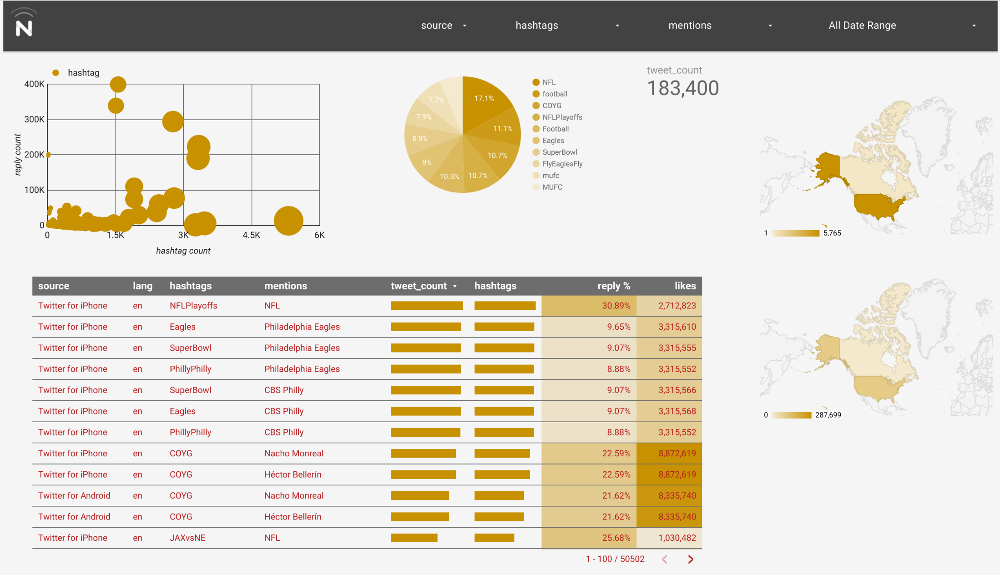

Twitter for BigQuery
===

This sample code will help you streaming Twitter data into BigQuery, and running simple visualizations. This sample also generates the queries you can run directly in the BigQuery interface, or extend for your applications.

Additionally, you can use other public or private datasets in BigQuery to do additional joins and develop other insights/correlations.

Requirements
---

- [Twitter App](http://apps.twitter.com) created with keys/tokens
- [Google Cloud Platform](https://cloud.google.com/) account

Setup & Configuration
---

To work with Google Cloud and BigQuery, follow the below instructions to create a new project, service account and get your PEM file.

- Go to [http://console.developers.google.com](http://console.developers.google.com)
- Click on "Create Project"
- Open the project dashboard by clicking on the new project
- Open "APIs & auth->Credentials"
- Click on "Create new Client ID", "Service account" and "Create Client ID"
- Note your Service Account email (Under "EMAIL ADDRESS")
- Generate and store your JSON key (Or save from auto-download)

Loading Twitter data into BigQuery from your local machine
---

As a pre-requisite for setting up BigQuery, you need to first set up a billing account. To do so:

- Go to [https://console.developers.google.com/billing](https://console.developers.google.com/billing) and add a credit card
- Back in your project view, click on the gear icon in the top-right and then "Project billing settings"
- Ensure your project is associated with a billing account

The enclosed sample includes a simple file to stream Tweets into Google Cloud Storage.

- Go to [http://console.developers.google.com](http://console.developers.google.com)
- Go to your project
- In the left-hand side, click on "Big Data->BigQuery" to open the BigQuery console
- Click on the down arrow by the project, select "Create new dataset" and enter "twitter"
- Run `npm install` then `npm start` to begin loading data from your local machine

When developing on top of the Twitter platform, you must abide by the [Developer Agreement & Policy](https://dev.twitter.com/overview/terms/agreement-and-policy).

Most notably, you must respect the section entitled "Maintain the Integrity of Twitter's Products", including removing all relevant Content with regard to unfavorites, deletes and other user actions.

The schema
---

### Sample queries

To help you get started, below are some sample queries.

##### Text search

Querying for tweets contain a specific word or phrase.

	SELECT text FROM [twitter.tweets] WHERE text CONTAINS ' something ' LIMIT 10

##### #Hashtag search

Searching for specific hashtags.

	SELECT entities.hashtags.text, HOUR(TIMESTAMP(created_at)) AS create_hour, count(*) as count FROM [twitter.tweets] WHERE LOWER(entities.hashtags.text) in ('John', 'Paul', 'George', 'Ringo') GROUP by create_hour, entities.hashtags.text ORDER BY entities.hashtags.text ASC, create_hour ASC

##### Tweet source

Listing the most popular Twitter applications.

    SELECT source, count(*) as count FROM [twitter.tweets] GROUP by source ORDER BY count DESC LIMIT 1000

##### Media/URLs shared

Finding the most popular content shared on Twitter.

	SELECT text, entities.urls.url FROM [twitter.tweets] WHERE entities.urls.url IS NOT NULL LIMIT 10

##### User activity

Users that tweet the most.

	SELECT user.screen_name, count(*) as count FROM [twitter.tweets] GROUP BY user.screen_name ORDER BY count DESC LIMIT 10

To learn more about querying, go to [https://cloud.google.com/bigquery/query-reference](https://cloud.google.com/bigquery/query-reference)

Going further
---

Using BigQuery allows you to combine Twitter data with other public sources of information. Here are some ideas to inspire your next project:

- Perform and store sentiment analysis on tweet text for worldwide sentiment
- Cross reference Twitter data to other [public data sets](https://cloud.google.com/bigquery/docs/sample-tables)

You can also visit http://demo.redash.io/ to perform queries and visualizations against publicly available data sources.

Additional reading
---

The following documents serve as additional information on streaming data from Twitter and working with BigQuery.

- *How to stream data from Twitter with tweepy [Python]:* [http://runnable.com/Us9rrMiTWf9bAAW3/how-to-stream-data-from-twitter-with-tweepy-for-python](http://runnable.com/Us9rrMiTWf9bAAW3/how-to-stream-data-from-twitter-with-tweepy-for-python)
- *Authorizing Access to the Google BigQuery API using OAuth 2.0:* [https://cloud.google.com/bigquery/authorization](https://cloud.google.com/bigquery/authorization)
- *Codelab: Creating a BigQuery Dashboard:* [https://cloud.google.com/bigquery/articles/dashboard#newApp Engineproject](https://cloud.google.com/bigquery/articles/dashboard#newApp Engineproject)
- *Uploading Your Application:* [https://cloud.google.com/App Engine/docs/python/gettingstartedpython27/uploading](https://cloud.google.com/App Engine/docs/python/gettingstartedpython27/uploading)
- *Data Visualization App Using GAE Python, D3.js and Google BigQuery:* [http://code.tutsplus.com/tutorials/data-visualization-app-using-gae-python-d3js-and-google-bigquery--cms-22175](http://code.tutsplus.com/tutorials/data-visualization-app-using-gae-python-d3js-and-google-bigquery--cms-22175)

Credits
---

- [Twitter for BigQuery](https://github.com/twitterdev/twitter-for-bigquery)